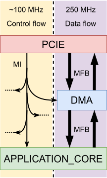

<!-- Copyright (c) 2024 Universitaet Heidelberg, Institut fuer Technische Informatik (ZITI) -->
<!-- SPDX-License-Identifier: CC-BY-4.0 -->

# DMA Calypte/JetStream 2.0 demonstration project

Welcome!

This repository contains a demonstration project for the DMA Calypte engine
(also known as JetStream 2.0). On top of that, it also creates a platform upon
which other projects can be built to benefit from the DMA engine. This allows
the acceleration cards to communicate with the host system. The platform has
been founded on the
[NDK-APP-Minimal](https://github.com/CESNET/ndk-app-minimal/) framework that has
been simplified for the ease of use and development.

## TL;DR

I know, I know, you skimmed the text below and you realized, that it is too long
to read. So here are just the most simple steps you have to take:

1. go to `/cards/<card_name>/build`
2. execute `make`
3. Wait for the build to finish but you can proceed to the next step.
4. Install `nfb-framework` package from the `ndk-sw` repository (If you have not
   done that, see [Software stack](#software-stack) section) on the machine the
   card is connected to.
5. Run Vivado's hardware manager and program the device (the `.bit` file is in
   the same folder).
6. Reboot the machine with the accelerator card (warm reset).
7. On the machine with the accelerator card, run `nfb-info`.
8. If everything went well, you should see information about the card name,
   number of RX/TX queues, PCIe slot, etc.
9. Congrats, the FPGA card has been initialized successfully!

Some more optional steps:
- The design can be configured using `/config/core_conf.tcl` file. Obviously, it
  has to be rebuilt when parameters are changed.
- In order to use the queues, there are several `ndp-*` testing tools that can
  be used for that:
  - `ndp-generate` for using the TX queues
  - `ndp-read` for using the RX queues
  - `ndp-loopback` using RX and TX queues in the FPGA -> Host -> FPGA loopback 
  - `ndp-loopback-hw` using RX and TX queues in the Host -> FPGA -> Host 
    loopback (It has to be ensured that the data will be looped in the
    FPGA firmware back towards the host. The data need to remain unchanged.).
- Look in the `sw/` folder for a usefull programs to use to interact with the
  design and the guid of how to build your custom communication tool. 

## Project documentation

This guide provides the documentation of various parts of this project:

1. Supported accelerator cards
2. Development software
3. Cloning the necessary repositories
4. Configuration of the design
5. Building a design for the accelerator card
6. Programming of the FPGA
7. Software stack for interaction between a card and a host
8. FPGA firmware description 

### Supported platforms

Currently, only two accelerator cards are supported:

- [AMD Virtex UltraScale+ FPGA VCU118 Evaluation Kit](https://www.xilinx.com/products/boards-and-kits/vcu118.html) 
  - located in `/cards/vcu118`
- [AMD Alveo U200 Data Center Accelerator Card](https://www.xilinx.com/products/boards-and-kits/alveo/u200.html) 
  - located in `/cards/alveo-u200`
- [AMD Alveo U55C High Performance Compute Card](https://www.xilinx.com/products/boards-and-kits/alveo/u55c.html) 
  - located in `/cards/alveo-u55c`

### Development software

The design has been built using *AMD Vivado 2022.2* which should be adhered to to
build the card's design effortlessly without the need to regenare IP files. 

<!-- The verification and simulation resources that can be found in various locations -->
<!-- throughout the repository were used within *Questa Sim-64 2023.1_2* environment. -->
<!-- The verification/simulation files are design for this environment to work out of -->
<!-- the box. -->

### Cloning the repositories

This repository contains two source submodules that need to be cloned in order
to have a complete stack:

```bash
git clone git@github.com:walliv/dma-calypte-demo.git 
cd dma-calypte-demo 
git switch valek-feat-app_manycore_system
git submodule update --init src/ofm
git submodule update --init src/app/BarrelRISCV
```

The [OFM (Open FPGA Modules)](https://github.com/walliv/ofm/) submodule contains
open-source VHDL components developed by [CESNET](https://github.com/CESNET).
This submodule also contains an elaborated build system to compose FPGA designs
from various VHDL files in modular fashion with a great degree of variability
and configurability. The documentation of various components within the OFM
repository as well as a thorough description of the features of the build system
can be found on the repository page. This demonstration project utilizes the
provided build system as well as many components that are provided in the OFM
repository. The following section describes how the VHDL design and the build
system can be configured.

## Configuration of the design

The stock design provides default setting of the FPGA firmware parameters. The
parameters can be found in either Makefiles or TCL scripts in the following
locations:

```
/
|---config/
|   |
|   |---Vivado.inc.tcl
|   |---bootstrap.tcl
|   |---core_conf.tcl
|
|---cards/
    |
    |---cards.mk 
    |---<card_name>/
        |
        |---build/
            |
            |---Makefile
            |---Vivado.tcl
```

The way these files are sourced is depicted in the following figure:

<figure>
		
		<figcaption>Order of sourcing of the configuration files</figcaption>
</figure>

### `/cards/<card_name>/build/Makefile`

This is the top most file in the design that gets called first to request a
build of the FPGA firmware. A different speed configurations regarding packet
throughput are specified here.

### `/cards/card.mk`

This file is sourced by the top Makefile to initialize necessary paths for
the design build. For path description, see [next
section](#description-of-a-build-of-a-fpga-firmware).

### `/cards/<card_name>/build/Vivado.tcl`

This is the main script called by both `tclsh` and by Vivado. It sets the build
parameters, like synthesis/implementation directives for each step, type of the
FPGA chip, top-module name and adding to the hierarchy of components with its
physical constrains as well.

### `/config/bootstrap.tcl`

This script is sourced in the beginning of the previous script and it takes care
of intializing all necessary paths for the TCL shell and also source
configuration files for the VHDL design together with subprocedures that are
checking if the set parameters are in allowed ranges (files
`/cards/<card_name>/card_param_check.tcl` and `/config/core_param_check.tcl`).

### `/config/Vivado.inc.tcl`

Being sourced on the end of the previous script, this collects card-independent
parameters (common parameters for all designs) and passes them to the
*COMPONENT* hierarchy and to the generated VHDL package. This package called
*combo_user_const* (in the file called
`/cards/<card_name>/build/*.netcope_tmp/netcope_const.vhd`) is generated
dynamically in the first steps of the build process every time `make` command
gets called.

### `/config/core_conf.tcl`

This file is a main configuration file for the user of the platform. It contains
TCL variables that manipulate the sources of the VHDL design as well as the VHDL
code itself. Some of these parameters (for example the amount of DMA channels)
get propagated to the *combo_user_const* package.

## Description of a build of a FPGA firmware

This project utilizes a build system provided within the *OFM* repository. This
build system allows hierarchical linking of design sources accross the directory
structure. The system has been developed to simplify the build of very large
designs where each source file can also be individually treated, meaning it can
be separately synthesized or verified regardless of being part of the whole FPGA
firmware. The configuration of the firmware described previously makes a large
part of the build system.

As you probably have noticed, when looking through the design sources, each HDL
file, e.g. each module has its own `Modules.tcl` script. This file lists all of
the subcomponents that have instantiated in the given VHDL or Verilog file. This
includes not only other HDL components, but also IP files (`.xci` extension) as
well as constraints added to global constrains for a given card. The script
essentially adds these sources to three TCL lists: *MOD*, *COMPONENTS* and
*PACKAGES*. The constrains are added in a similar fashion to the
*SRCS(CONSTR_VIVADO)* list.

1. The *PACKAGES* list contains all the packages used in the current design.
2. The *MOD* list contains "local" sources within the given directory. These
   sources need to be added one after another in order of their position in the
   hierarchy from bottom to top.
3. The *COMPONENTS* list contains "remote" sources (mostly from other
   directories) that contain their own `Modules.tcl` files. This is why only a
   path the the wanted component needs to be given because its `Modules.tcl` is
   scanned. 
  
From the description of the *COMPONENTS* list, it is obvious that using
`Modules.tcl` allows to dynamically source an arbitrary amount of sources. This
simplifies addition of the source to the design hierarchy and the user can
operate individually with the source files, meaning separately synthesize them
or do a verification on them. For a complete list of how to further specify
these lists, see
[description](https://cesnet.github.io/ofm/build/readme.html#hierarchy-description-in-modules-tcl).

The build of a design works with multiple path types during the initial steps of
the design compilation:

| Path name     | Description                                                                          |
|:-------------:|:-------------------------------------------------------------------------------------|
| COMBO_BASE    | Root of a repository, e.g. the location of this `README.md` file.                    |
| FIRMWARE_BASE | (Discontinued) Same as COMBO_BASE, left for compatibility reasons.                   |
| OFM_PATH      | Path to the OFM library of open-source VHDL components. Currently set to `/src/ofm/` |
| CARD_BASE     | Path to the subfolder of the built card. Currently set to `/cards/<card_name>/`      |
| CORE_BASE     | Path to card-independent sources. Currently se to `/src/`                            |

Various other constants/parameters for VHDL design configuration (like the PCIe
module setting, the DMA module type or the amount of DMA channels) are passed
throughout the build files. The description of them can be seen in the
configuration files described above (the files should be examined from the top
to the bottom). 

## Programming the FPGA

The build of a design results in a generation of a bitstream file (`*.bit`).
This file is generated in the same directory as the top most *Makefile*. The
FPGA cards can be programmed using the JTAG port and *Vivado Hardware Manager*.
Some devices can support programmig using `nfb-boot` tool provided by the
*ndk-sw* software stack. This programming mode allows to program devices
directly through the PCIe interface without using external JTAG cable.
Information about the support of this feature can be found in the `README.md`
files by each card.

## Software stack

The [ndk-sw](https://github.com/CESNET/ndk-sw) software stack provides a *nfb*
Linux driver, *libnfb* library and basic testing tools to be able to interact
with the design and to develop custom application using it. Unless you have
already installed the newest version of the package on your machine, the build
instruction for a package can be found on the repository page. The supported
platforms are, mainly, RHEL and Ubuntu; experimentally, there is a support for
ArchLinux-based distributions.

The `/sw/` directory contains basic C programs to send/receive data in using the DMA
Calypte engine with the provided software stack. The code has been throughly
commented to provide detailed knowledge about the intialization as well as about
the data transport. During the data transport the order of bytes is retained
throughout the system meaning bytes sent on the lower bits of the bus word in
the FPGA are received first and are available as first in the host, referenced
by the data pointer in the `ndp_packet` packet structure in the software (see
the provided C programs `pkt_send.c` and `pkt_receive.c` to get it more clear).
From the software point of view, the entire communication architecture behaves
as one large FIFO in each direction where data can be independently read from or
written to.

Be sure to always compile the specific code using the `-lnfb` flag. In order
to attain this switch, the ndk-sw *libnfb* C library needs to be installed on
the system.

```bash
# Example of a compilation of a custom program
gcc pkt_receive.c -o pkt_receive.bin -lnfb
```

## FPGA firmware description

The block scheme of the FPGA firmware can be seen in the following figure:

<figure>
		
		<figcaption>Basic architecture view of the design</figcaption>
</figure>

### PCI Express module

The FPGA firmware consist of multiple parts from which the most important is the
PCIe module. This module encapsulates the [UltraScale+ Device Integrated Block
for PCI Express
(PCIe)](https://www.xilinx.com/products/intellectual-property/pcie4-ultrascale-plus.html)
IP core that shadows the complexity of the PCIe protocol. The IP provides the
*AXI-Stream* interface which different devices can use to communicate. The IP is
configured as an Endpoint meaning it has to be discovered by the host in order
to be operational. The data transmitted over the PCIE are split into two flows,
the control flow and the data flow. 

- The control flow is communicated throughout the design over a  memory-mapped
  interface called [MI](https://cesnet.github.io/ofm/comp/mi_tools/readme.html).
  This interface is normally used to access the Configuration and Status (C/S)
  registers of various components in the firmware. This implies the
  existence of Master in the bus hierarchy which is the host (more specifically
  the software process) which manages the accelerator card. The interface
  can be also used for limited send of data from the host to the FPGA firmware
  (The "limited" keyword comes from two properties, namely the width of the bus,
  which is 32 bits and the frequency of its driving clock, which is set around
  100 MHz).
- The data flow is used to transmit large amounts of data in both directions,
  that is Host-to-FPGA (H2F, in the source files called TX) and FPGA-to-Host
  (F2H, in the source files called RX) at the same time (the communication is
  full-duplex). For that, a pair of communication busses is established (one in
  each direction). Each of them adheres to the specification of the
  [MFB](https://cesnet.github.io/ofm/comp/mfb_tools/readme.html) which is an
  improved  AXI-Stream-like streaming interface. The communication speed of this
  interface can theoretically reach up to 16 GBps and generally depends on the
  configuration of the PCIe Endpoint. A current default version runs on speeds
  reaching ~4 GBps (not very optimized version, I know) on the interface capable
  of theoretical 8 GBps of communication speed. This is the result of the
  interface configuration, in this case having a width of *256b@250MHz*. The 16G
  variant is a configuration with a bus width of *512b@250MHz*. 
  
### DMA engine

The communication over the PCI Express cannot happen out of a blue since writes
to the restricted memory ranges can happen (The PCIe devices operate on
physical address space). Therefore, a DMA engine has been created over the PCIe
interface to control the data flow. This engine communicates with the rest of
the FPGA firmware using communication units called packets (sometimes also
called frames but usage of this name is discouraged) of variable size. This size
can be in range between 60 B to 4096 B. Each packet is accompanied by metadata
such as its length in bytes and the channel on which it is transmitted. Each
direction of the data flow has its specific amount of virtual channels
("logical" means they all share the same bus). Each direction is therefore
controlled by a separate controller of which every channel can be
independently turned on and off.  When a channel is turned off it does not
transmit data and packets that arrive on it are dropped.

The DMA engine on the side towards the *APPLICATION_CORE* exchanges data using
the MFB interface. A small loopback module has been added between the
communication busses to allow minor testing by turning the data from TX back to
RX to check the seamlessness of the communicaton at the host.

### Application core

The DMA module is connected directly to the user defined logic called an
[Application core](src/app/README.md). This core provides an interface with the
DMA engine and can contain many different architectures (i.e. accelerators,
filters and so on), e.g. wrappers for user logic. The user can switch between
them using the `APP_CORE_ARCH` parameter in the
[/config/core_conf.tcl](config/core_conf.tcl) file. The Application core is
connected directly to the DMA engine. 

### Clocking infrastructure

The FPGA firmware is driven by two external clocks, namely `PCIE_SYSCLK_{P,N}`
and `REFCLK_{P,N}`. The first are used by the PCIe IP to obtain synchronization
on the PCIe bus interface. This clock is basically unusable since it is
connected directly to the transceivers at the PCIe IP. The second clock is
customly selected as the most stable clock from the offer of clocks in the given
FPGA card. This clock is passed through a system buffer to the *MMCM* component
to create custom clock signals in the design. The depiction of the default
clocking infrastructure is shown in the following figure:

<figure>
		
		<figcaption>Schematic view of the clock infrastructure</figcaption>
</figure>

An accelerator card can utilize multiple clocks where some of them may be
already available inside each card's specific `general.xdc` constraints file.
Normally, only one clock is used and constraints to the second one would be 
provided in a comment.

#### Multi-mode clock manager (MMCM)

The MMCM is wrapped inside the `/src/clk_gen/clk_gen_usp.vhd` architecture of the
`COMMON_CLK_GEN` entity. This can be set through generic parameters to provide
up to 7 independent clock signals (2 are used in the current design). The clocks
are ordered from the highest frequency to the lowest where 0 has the highest.
The last clock in the row is usually used to drive the components on the MI bus
since this interface can span the whole design and the higher frequency for the
configuration/status interface is not necessary. The MMCM parameters can be set
in the top-level entity (`/cards/<card_name>/src/fpga.vhd`) with the *CLK_COUNT*,
*PLL_MULT_F*, *PLL_MASTER_DIV*, *PLL_OUT0_DIV_F* and *PLL_OUT_DIV_VECT* generic
constants in the `FPGA_COMMON` instance. For the ranges of allowed values for
the every parameter, refer to the
[UG572](https://docs.amd.com/r/en-US/ug572-ultrascale-clocking). 

The clocks of the MMCM are packed to the `clk_vector` signal inside a
`FPGA_COMMON` architecture and distributed throughout the design as such. The
first distribution can be seen already here where the MI components are selected
to be driven by the slowest clock (set by parameter `MI_CLK_IDX`) whereas, for
example, the fastest clock (set by `USR_CLK_IDX`), is chosen from the lower bits
of this vector. Other `*_CLK_IDX` parameters can be added after the extension of
the clock vector. This can be done in the upper level entity with the
*CLK_COUNT*. Each clock has an assigned reset signal and each of them is packed
in the `rst_vector` located in the `FPGA_COMMON` entity.

#### Another clock signals

The PCIe IP generates another clock (also with its reset) propagated to the
`APPLICATION_CORE` as *PCIE_USER_CLK* this clock is generally set to 250 MHz
for all of the supported configurations on the provided accelerator cards.

## Logical architecture

Because the overall architecture seems to be quite difficult to grasp because of
all of the components that need to be studied, the following picture provides an
overview of the components on the first 3 levels of the hierarchy: 

<figure>
		
		<figcaption>Logical overview of the first 3 levels of the architecture</figcaption>
</figure>

The `FPGA` entity is the top-level entity of the whole design. This entity is
specified by the `SYNTH_FLAGS(MODULE)` parameter in the
`/cards/<card_name>/build/Vivado.tcl` file. This entity is specific for each card
because each card has a different physical connections on its board, different
clock frequencies, etc. 

The `FPGA_COMMON` combines common components among different accelerator cards.
The main parts in this entity are the `PCIE`, the `DMA` and the
`APPLICATION_CORE` instances that were already described in the previous
sections. Apart from these, other modules are included:

- `COMMON_CLK_GEN` (mentioned previously) to provide stable
	user-defined clocks throughout the design. 
- The `MI_SPLITTER_PLUS_GEN` instance that splits the MI interface from the
  `PCIE` module for different components. The address spaces for these are
  specified in the `/src/mi_addr_space_pkg.vhd` file.
- The `hwid` component reads a DNA number of an FPGA and provides
  this number to other components. This number is used to uniquely identify
  the accelerator card in the PCIe domain. The number is also available as a
  signal in the `APPLICATION_CORE` entity.
- `MI_TEST_SPACE` is used to test the access on the MI bus from the host. This
  module instantiated a small array of registers to which software can write and
  read data.
- `SDM_CTRL` contains a *SYSMON* component to monitor the temperature of the
  board. 
- `RESET_TREE_GEN` splits the global reset to multiple branches that are
  connected through the entire design. This global reset (signal `global_reset`
  in the *FPGA_COMMON* entity) is asserted until a PLL in the MMCM comes to a
  lock. 

## Further reading 

These are another sections within the documentation of this repository:

- [Development of custom components](tutorials/new_component/README.md)
- [Managing custom build of the design](tutorials/custom_build/README.md)
- [Application core architecture](src/app/README.md)
- [Software tools](sw/README.md)

## Vocabulary

- **Endpoint** is a device in the PCIe domain that has to be localized by the
  host system in order to work. The host sysem contains the *Root Complex* to
  which all of these *Endpoints* are routed.
- **Packet** is a communication unit containing multiple bytes of data.
- **Frame** is the same communication unit as the packet, alghtough the name 
  "packet" is preferred.
- **Word** is either:

  1. One bus beat, meaning communicated amount of data on a bus in one clock
      period. Also called *Bus word*
  2. In terms of the PCIe domain, 16 bits (2 Bytes) of data. In fact, the PCIe
      domain works with larger units, namely s.c. *Double Words (DW)* containing
      32 bits (4 Bytes) of data.
- **Channel** is a group of packets communicated over a streaming bus in the
  hardware. Every communication direction containes a user-defined amount of
  channels. This specific definition of a channel is sometimes referred to as a
  *Virtual channel*.
- **Queue** is a software representation of a channel. Each queue is independent
  as well as its underlying channel.
- **Stream** is a packet traffic communicated over a streaming bus in both
  communicationa directions through a single PCIe Endpoint. Usually, each DMA
  engine creates its own DMA stream.
- **Component** is a HDL entity with an architecture that is part of the FPGA
  firmware. 
- **Module** is a collection of more that one component that also puts this
  collection into a specific place of the hierarchy.

## Repository Maintainer

- Vladislav Válek <vladislawalek@gmail.com>
