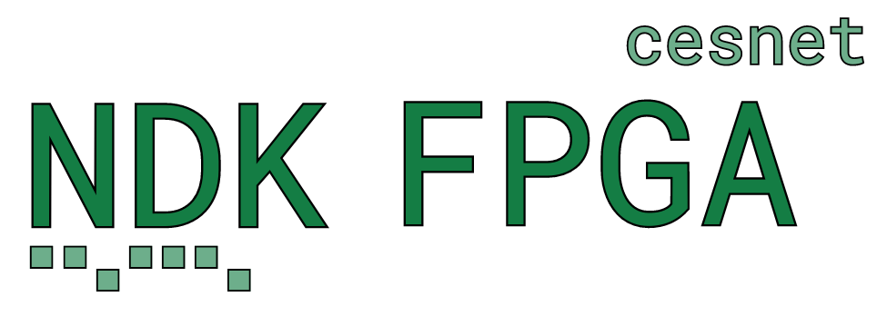

.. currentmodule:: ndk_fpga

Overview
========

.. toctree::
    :maxdepth: 2
    :caption: Network Development Kit:
    :hidden:

    ndk_core/doc/how_to_start
    ndk_core/doc/terminology
    ndk_core/doc/readme
    ndk_core/doc/configuration
    ndk_core/doc/testing
    ndk_build/readme
    ndk_core/doc/devtree
    ndk_core/doc/faq

The **Network Development Kit (NDK) for FPGAs** is a comprehensive framework designed
for the rapid and efficient development of FPGA-accelerated network applications. Optimized
for scalability and high throughput, the NDK supports speeds up to **400 Gigabit Ethernet**.

--------

The NDK provides a minimal example application. The **NDK Minimal Application**
demonstrates how to build an FPGA application using the NDK and serves as a starting point
for your own development. The minimal application doesn't process network packets; it simply
sends and receives them. If a DMA IP is enabled (see the :ref:`DMA Module <ndk_dma>`),
the packets are forwarded to and from the host's memory. Otherwise, DMA IP is replaced with
a loopback and packets may be forwarded from RX to TX ethernet interface.

Other example applications will be added in the future, stay tuned!

.. toctree::
    :maxdepth: 1
    :caption: Applications

    app-minimal

--------

In addition, the NDK provides a collection of reusable components, some of which are vendor and
vendor- and tool-independent, while others are optimized for specific FPGA vendors and architectures.
For transferring packets (frames) and auxiliary data at such high rates, the NDK uses its own set of what are called
"multibuses" that can transfer multiple frames and values, respectively, within a single clock cycle.
For details on these protocols, see the specifications for the :ref:`Multi Value Bus<mvb_bus>` and
:ref:`Multi Frame Bus<mfb_bus>`.

To simplify module development, the NDK includes components for common operations on these buses,
multiplexers, FIFOs, BRAMs and lookup tables. To improve compatibility with other popular buses,
it also provides converters:

* MFB to AXI stream,
* MFB to Avalon stream,
* MI to Avalon MM,
* MI to AXI4,
* MVB to MFB.

.. toctree::
    :maxdepth: 1
    :caption: Reusable Modules Library

    base
    ctrls
    mi
    mfb
    mvb
    nic
    pcie
    debug
    ver

--------

.. toctree ::
    :maxdepth: 1
    :caption: Bus Specifications

    comp/mi_tools/readme
    comp/mvb_tools/readme
    comp/mfb_tools/readme

--------

The NDK supports a wide range of FPGA cards, providing access to features such as DDR and HBM
memories, PCIe, and Ethernet in your applications. However, different applications may only
support a subset of these cards. A complete list of supported FPGA cards can be found below
(minimal app supports all of them).

.. toctree::
    :caption: Supported Cards
    :maxdepth: 1

    ndk_cards/reflexces/agi-fh400g/readme
    ndk_cards/intel/dk-dev-1sdx-p/readme
    ndk_cards/intel/dk-dev-agi027res/readme
    ndk_cards/silicom/fb4cgg3/readme
    ndk_cards/silicom/fb2cghh/readme
    ndk_cards/silicom/n6010/readme
    ndk_cards/bittware/ia-420f/readme
    ndk_cards/amd/alveo-u200/readme
    ndk_cards/amd/alveo-u55c/readme
    ndk_cards/amd/vcu118/readme
    extra/nfb-200g2ql/readme
    ndk_cards/prodesign/pd-falcon/readme

--------

NDK provides two implementations of DMA IPs:

* DMA Medusa
* DMA Calypte

DMA Medusa is a state-of-the-art DMA module that supports up to 400Gbps of throughput to
host memory. DMA Calypte is an open-source low-latency DMA supporting throughput up
to tens of Gigabits per second. However, the DMA Calypte is still under development
and is not yet officially released (stay tuned).

.. warning::

    The DMA Medusa IP is not included in the open-source version of the NDK. `You can obtain the full NDK package, including DMA Medusa IP and professional support, from our partner BrnoLogic. <https://support.brnologic.com/>`_

.. image:: img/liberouter_logo.svg
    :align: center
    :width: 50 %
